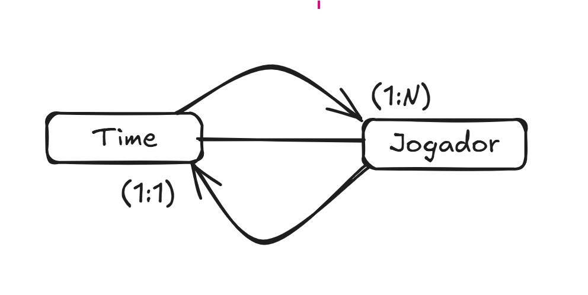
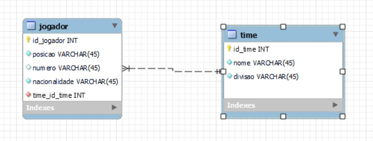
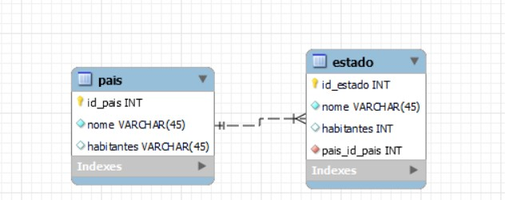
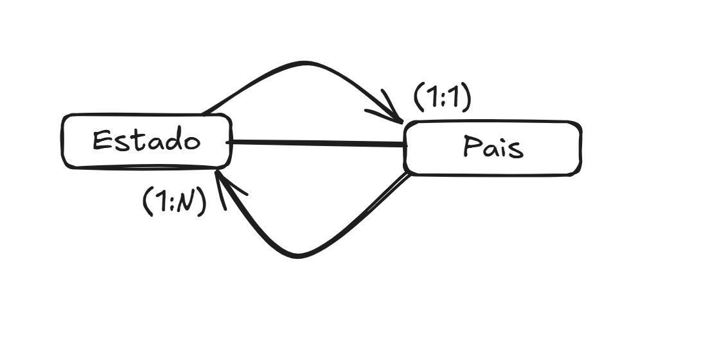
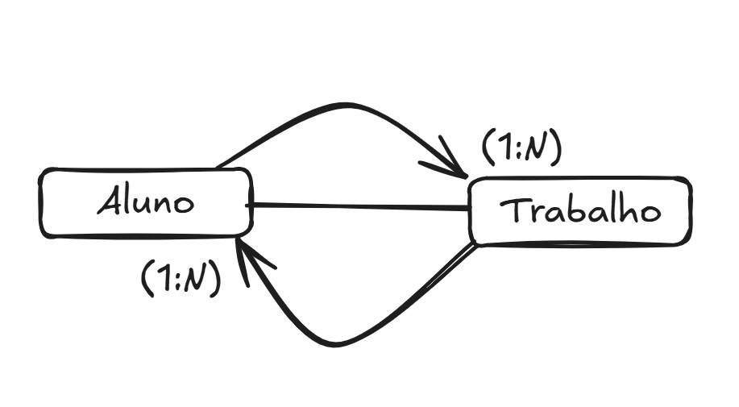
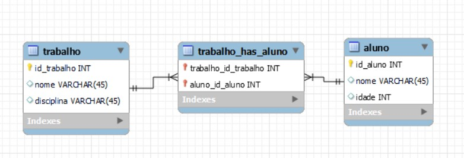
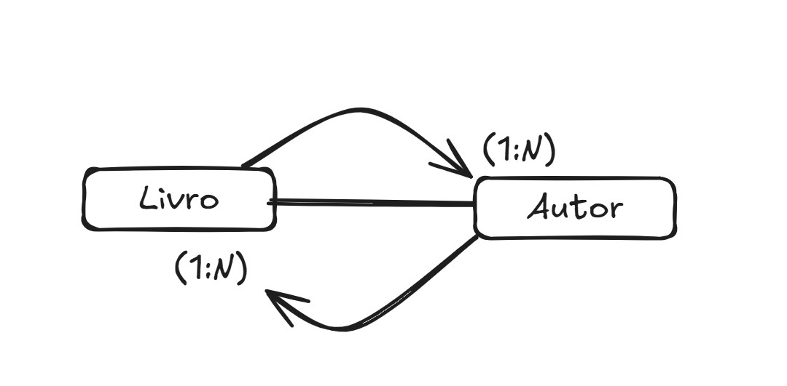
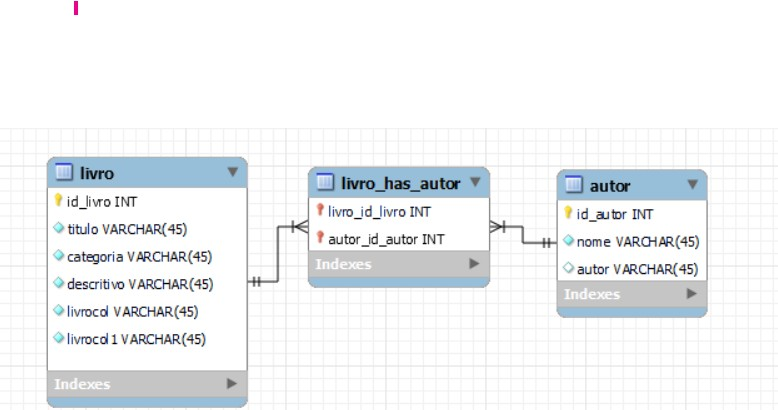
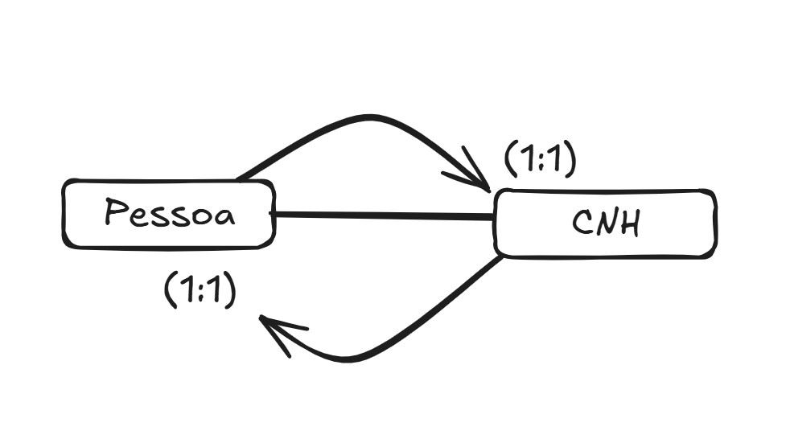
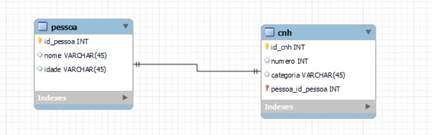

# 🧩 Modelagem Lógica com MySQL Workbench

Este guia apresenta como construir a **modelagem lógica de banco de dados** utilizando a ferramenta **MySQL Workbench**, com exemplos clássicos de relacionamento entre entidades. O foco é aplicar os conceitos de entidade-relacionamento na prática com visualização gráfica.

---

## 💻 Ferramenta: MySQL Workbench

O MySQL Workbench é uma IDE visual que permite:
- Criar diagramas EER (Entidade e Relacionamento Estendido);
- Definir tabelas, chaves primárias e estrangeiras;
- Gerar scripts SQL automaticamente;
- Fazer engenharia reversa de bases já existentes.

🔗 Download: [https://www.mysql.com/products/workbench/](https://www.mysql.com/products/workbench/)

---

## 🪜 Passos Iniciais para Criar o Modelo

1. Abra o MySQL Workbench.
2. Clique em **File > New Model**.
3. Na aba **EER Diagram**, clique em **Add Diagram**.
4. Use os ícones para adicionar entidades (tabelas) e relacionamentos.

---

## ⚽ Exemplo 1: Jogador × Time (1:N)

**Descrição:** Um time possui vários jogadores, mas cada jogador pertence a apenas um time.

**Modelagem:**
- Entidades: `Time`, `Jogador`
- Relacionamento: 1:N (Time → Jogador)
- Chave estrangeira: `id_time` em `Jogador`

**Modelo Conceital**

**Modelo Lógico**

---

## 🌎 Exemplo 2: Estado × País (1:N)

**Descrição:** Um país pode conter vários estados, cada estado pertence a apenas um país.

**Modelagem:**
- Entidades: `Pais`, `Estado`
- Relacionamento: 1:N (Pais → Estado)
- Chave estrangeira: `id_pais` em `Estado`

**Modelo Conceital**

**Modelo Lógico**

---

## 👨‍🎓 Exemplo 3: Aluno × Trabalho (N:M)

**Descrição:** Um aluno pode entregar vários trabalhos e um trabalho pode ser entregue por vários alunos.

**Modelagem:**
- Entidades: `Aluno`, `Trabalho`, `Entrega` (entidade associativa)
- Relacionamento: N:M resolvido com entidade `Entrega`
- Chaves estrangeiras: `id_aluno`, `id_trabalho` em `Entrega`

**Modelo Conceital**

**Modelo Lógico**

---

## 📚 Exemplo 4: Livro × Autor (N:M)

**Descrição:** Um livro pode ter vários autores, e um autor pode escrever vários livros.

**Modelagem:**
- Entidades: `Livro`, `Autor`, `LivroAutor` (associativa)
- Relacionamento: N:M resolvido com `LivroAutor`
- Chaves estrangeiras: `id_livro`, `id_autor`

**Modelo Conceital**

**Modelo Lógico**

---

## 🪪 Exemplo 5: Pessoa × CNH (1:1)

**Descrição:** Uma pessoa pode ter uma única CNH, e uma CNH pertence a uma única pessoa.

**Modelagem:**
- Entidades: `Pessoa`, `CNH`
- Relacionamento: 1:1
- Chave estrangeira: `id_pessoa` em `CNH`

**Modelo Conceital**

**Modelo Lógico**

---

## ✅ Boas Práticas na Modelagem Lógica

- Nomeie chaves primárias com `id_` + nome da tabela.
- Use tipos apropriados: `INT`, `VARCHAR`, `DATE`, etc.
- Aplique `NOT NULL` e `UNIQUE` conforme necessário.
- Documente relacionamentos com cardinalidades.

---

## 🧠 Conclusão

A modelagem lógica com MySQL Workbench é uma etapa fundamental para transformar a visão conceitual do banco de dados em uma estrutura pronta para implementação. Dominar o uso da ferramenta acelera o desenvolvimento e garante consistência no design.

---

🔗 Recurso extra: [Modelagem no Workbench - YouTube](https://www.youtube.com/results?search_query=modelagem+mysql+workbench)
